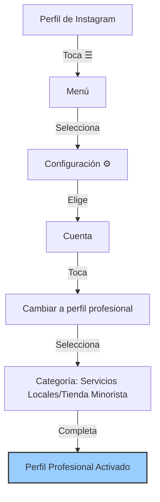
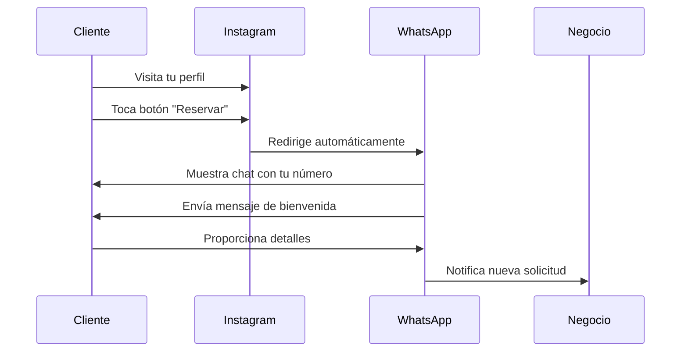

# 📲 Manual para Principiantes: Vincular Botón "Reservar" de Instagram a WhatsApp

## 🎯 Objetivo
Configurar el botón de acción "Reservar" en tu perfil de Instagram para dirigir automáticamente a tus clientes hacia WhatsApp, facilitando la comunicación y aumentando las conversiones.

## 📋 Requisitos Previos

| Requisito | Descripción |
|-----------|-------------|
| ✅ Cuenta de Instagram | Convertida a perfil profesional (gratuito) |
| ✅ WhatsApp Business | Instalado y configurado en tu dispositivo |
| ✅ Dispositivo | Acceso desde celular o computadora |

## 🛠️ Proceso de Configuración

### 1. Convertir tu cuenta a Perfil Profesional



⚠️ **Importante:**
- No requiere pagos adicionales
- Te da acceso a estadísticas y botones de acción
- Mejora la visibilidad de tu negocio

### 2. Agregar el Botón "Reservar"

```mermaid
flowchart LR
    A[Perfil] -->|Toca| B[Editar perfil]
    B -->|Desplaza| C[Botones de acción]
    C -->|Selecciona| D[Añadir botón]
    D -->|Elige| E[Reservar 🗓️]
    E -->|Selecciona| F[WhatsApp]
    F -->|Ingresa| G[Número +58...]
    G -->|Toca| H[Listo y Guardar]
    H -->|Aparece| I[Botón visible en tu perfil]

    style I fill:#9cf,stroke:#333,stroke-width:2px
```



✅ **Verificación:**
- El botón debería aparecer debajo de tu biografía con el ícono distintivo de WhatsApp
- Cualquier visitante podrá acceder directamente a tu WhatsApp al tocarlo

### 3. Personalizar el Mensaje de Bienvenida en WhatsApp Business

Para ofrecer una mejor experiencia, configura un mensaje automático:

1. En WhatsApp Business, accede a **Configuración → Mensaje de bienvenida**
2. Redacta un mensaje profesional como este:

```
¡Hola! 👋 Gracias por contactar a *Lavaprenda* 🧺.

Por favor, proporciónanos:
1. Tu dirección 🏠
2. Tipo de servicio (lavado, planchado, etc.) 👔
3. Fecha preferida 📅

¡Te enviaremos un recogedor en menos de 1 hora! 🚚
```

3. Activa la opción y guarda los cambios

### 4. Probar el Funcionamiento del Botón



🔧 **Solución de problemas:**
- Si WhatsApp no se abre, verifica que el número esté correctamente escrito con código de país (+584247795381)
- Asegúrate que WhatsApp Business esté activo y configurado con ese número
- Revisa la conexión a internet del dispositivo

## 💡 Optimización y Mejores Prácticas

### Estrategias para Maximizar Conversiones

| Estrategia | Implementación | Beneficio |
|------------|----------------|-----------|
| **Biografía efectiva** | Incluir horarios y promociones | Mayor claridad para clientes |
| **Destacar en Stories** | Mencionar "Toca *Reservar* para programar" | Educación a usuarios |
| **Respuesta rápida** | Contestar en menos de 1 hora | Aumenta 40% las conversiones |
| **Guías visuales** | Crear Stories destacadas con instrucciones | Facilita experiencia del usuario |

### Ejemplo de Flujo Completo del Cliente

```mermaid
graph LR
    A[Cliente ve tu perfil] --> B[Cliente toca 'Reservar']
    B --> C[WhatsApp se abre automáticamente]
    C --> D[Mensaje de bienvenida personalizado]
    D --> E[Cliente proporciona información]
    E --> F[Confirmación de recogida]
    F --> G[Servicio completado]
    G --> H[Seguimiento y reseña]

    style A fill:#f9f,stroke:#333,stroke-width:1px
    style H fill:#9cf,stroke:#333,stroke-width:2px
```



## 🚨 Solución de Problemas Comunes

| Problema | Causa Probable | Solución |
|----------|----------------|----------|
| El botón no aparece | Perfil no profesional | Verifica que hayas completado la conversión a perfil profesional |
| WhatsApp no se abre | Problemas de integración | Reinstala WhatsApp Business o actualiza Instagram |
| Mensaje no personalizado | Configuración incompleta | Revisa la configuración del "mensaje de bienvenida" |
| No llegan solicitudes | Baja visibilidad | Promociona el botón en tus publicaciones y Stories |

## 📊 Medición de Resultados

Para evaluar el éxito de tu implementación:
1. Revisa las estadísticas de Instagram (visitas al perfil)
2. Contabiliza cuántos clientes llegan a través del botón
3. Calcula la tasa de conversión (clientes que completan reservas)
4. Ajusta tu estrategia según los resultados obtenidos

## 📅 Próximos Pasos

- Crea una guía visual para tus seguidores
- Establece un sistema de seguimiento para las solicitudes
- Actualiza regularmente tu biografía con promociones nuevas
- Considera automatizar respuestas frecuentes en WhatsApp Business

---

**Créditos:** *Documento creado para Lavaprenda - 27 Feb 2025*  
⚠️ *Uso exclusivo interno - Prohibida su distribución*
